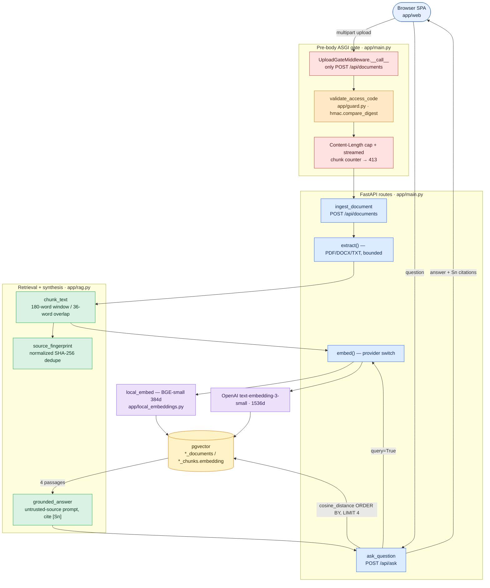

# Textify context

This is the compact source of truth for engineers and coding agents. Read it with `README.md`, `MEMORY.md`, and `docs/TESTING.md` before changing the product. Git, GitHub Actions, and the live `/health` response are authoritative for exact release identity; prose is never proof that a commit was published.

## Product contract

Textify is a private, single-user, citation-first RAG study workspace. A learner unlocks one shared workspace, indexes a PDF, DOCX, or TXT source, selects that source, asks a question, checks an answer against four retrieved passages, and can delete the source. It is deliberately small: no accounts, tenant isolation, OCR, background jobs, URL ingestion, quiz generation, glossary generation, or export workflow is part of the active FastAPI product.

The shipped UI is the **redesign-glass** single-page app (`app/web/`), served at `/`: a rail + shell "glass" workspace with three numbered stages — **01 · Index** (Sources screen), **02 · Retrieve** (the default Ask screen), **03 · Answer** — plus a ⌘K/Ctrl-K command palette, an access-code lock card, and a source-excerpt detail panel that opens when a `[Sn]` citation is clicked. The retired `app/templates/` Jinja pages (`PDF.html`, `RAW_result.html`, …) are historical Flask artifacts and are NOT what `app.main:app` serves.

Two embedding backends exist. The **local** path uses a pinned quantized `BAAI/bge-small-en-v1.5` ONNX model (384-d): no embedding API key, no hosted embedding call, and it is the default `fly.local-embeddings.toml` target. The **OpenAI** path uses `text-embedding-3-small` (1536-d). Note the currently-live `textify-abheet19` instance reports `embedding_provider: openai` / `1536` from `/health` — the deploy in front of users at time of writing runs the OpenAI path, while local-BGE is the zero-embedding-cost alternative. Claude or OpenAI answer generation is optional and can cost money; without a generation key, Textify returns retrieved evidence explicitly as `evidence-only`.

## User states and CTAs

| State or control | Expected behavior |
| --- | --- |
| `Light theme` / `Dark theme` | switches theme, persists only the theme preference, and exposes `aria-pressed` |
| Access code + `Unlock workspace` | lists sources on success; shows an in-page 401/503 message on failure; stores the code in `sessionStorage`, never `localStorage` |
| `Lock workspace` | aborts pending browser work, removes the session code, hides sources and evidence, and prevents stale responses from reappearing |
| File picker + `Build evidence index` | accepts PDF/DOCX/TXT, shows busy/success/deduplicated/error states, then selects the indexed source |
| Indexed source selector | changes the active document, enables deletion, clears old evidence, and cancels an obsolete ask |
| `Remove source` | cancel leaves data intact; accept deletes the document and cascading chunks, then clears evidence |
| Question + `Find supported answer` | validates selection/question, retrieves within the selected document, renders answer/citations as text, and recovers from provider errors |

## Request and data flow

```text
browser
  -> pre-body upload gate: access-code check + raw request cap
  -> FastAPI route validation and per-client process-local budget
  -> bounded extraction: PDF / DOCX / UTF-8 TXT
  -> normalized full SHA-256 dedupe (legacy 16-hex fingerprints remain readable)
  -> sentence-aware chunks: 180 words, 36-word overlap
  -> local BGE passage vectors (384d) or optional OpenAI vectors (1536d)
  -> short PostgreSQL/pgvector transaction

question
  -> short existence check -> query embedding outside DB session
  -> selected-document cosine top four -> close DB session
  -> escaped, explicitly untrusted evidence
  -> optional grounded generation or evidence-only response
  -> textContent rendering with visible citations
```

Provider and CPU inference must never hold a database connection. Local and OpenAI embeddings use separate table pairs and must never be mixed.

## Active code map

| Path | Responsibility |
| --- | --- |
| `app/main.py` | ASGI upload gate, FastAPI lifespan/middleware/routes, parsers/bounds, ORM, provider selection, health/readiness |
| `app/guard.py` | constant-time shared-code validation and rolling upload/question budgets |
| `app/rag.py` | normalization, chunking, compatible fingerprints, prompt isolation, answer-provider schema validation |
| `app/local_embeddings.py` | pinned offline BGE load, query/passage encoding, shape checks, serialized inference |
| `app/web/index.html` | redesign-glass single-page UI: rail, shell, Ask/Sources/New/Settings screens, command palette, lock card, detail panel; semantic labels/status regions |
| `app/web/app.js` | locked/unlocked state machine, screen router, command palette, request cancellation/versioning, safe `textContent` rendering, theme state |
| `app/web/app.css` + `app/web/vendor/glass/*` | responsive glass visual layer, tokens/primitives, focus/control styles |
| `tests/` | unit, security, PostgreSQL/pgvector integration, provider failure, file-boundary, and browser contracts |
| `tools/capture-reel60.mjs` | Playwright→ffmpeg capture of the live redesigned flow; motion-interpolated 60fps MP4 + looping GIF into `docs/media/` |
| `tools/record-demo.mjs` + `tools/build-demo-gif.py` | earlier frame-by-frame demo recorder/assembler (pre-redesign flow) |
| `tools/verify-browser.mjs` | Chromium CTA/injection/stale-response/axe checks; NOTE: written against the pre-redesign DOM contract (`#access-status`, `#answer`, `#citations`) and predates the glass redesign — treat as historical until refreshed |
| `Dockerfile*`, `fly*.toml` | fail-closed provider and preferred local-BGE production images/Fly shape |
| `.github/workflows/ci.yml` | lint/format/audit, disposable pgvector, browser, exact-image, and local-BGE container gates |
| `.github/workflows/fly-deploy.yml` | manual verify-before-deploy workflow and exact live SHA check |

`app/service.py`, `app/templates/`, older `app/static/`, `run.py`, and `config.py` are retained historical Flask/TextRank artifacts. They are outside `app.main:app` and the production images. Do not infer current features from them.

## Enforced limits

| Boundary | Value |
| --- | ---: |
| raw multipart request | 3 MiB file plus 64 KiB framing allowance |
| file content | 3 MiB |
| PDF | 200 pages |
| expanded DOCX members | 12 MiB |
| extracted text | 120,000 characters |
| chunks / passage bytes | 120 / 4,096 |
| OpenAI embedding batch | 32 |
| question | 6–500 characters |
| retrieved evidence | top 4 passages |
| generated answer | 350 tokens |
| process-local budgets | 3 uploads/hour and 12 asks/hour per client |

Production images set `TEXTIFY_REQUIRE_ACCESS_CODE=1`. Upload authentication runs before multipart parsing, so an anonymous body is rejected without being spooled. Oversized `Content-Length` and chunked bodies are bounded before an `UploadFile` exists. Public readiness also requires a lowercase 40-character Git SHA. Responses are `no-store` and include CSP, framing, MIME, referrer, and browser-permission restrictions. Source text and filenames are rendered as text.

## Engineering and interview concepts

- **Python/FastAPI:** ASGI receive/send middleware, dependency-free guards, Pydantic request contracts, thread-pool execution for synchronous routes, typed ORM models, exception-to-HTTP mapping.
- **RAG/NLP:** normalization, overlapping chunk windows, query-versus-passage embeddings, cosine distance, retrieval scope, grounded prompting, abstaining with evidence-only output.
- **DSA:** linear chunking and hashing; deque-based amortized O(1) rolling windows; top-k vector ordering over a bounded per-document set; uniqueness for idempotency and race recovery.
- **JavaScript:** DOM state machine, `AbortController`, stale-result version tokens, safe `textContent`, `FormData`, async error recovery, session/local storage boundaries.
- **TypeScript:** N/A in the shipped frontend; it is plain browser JavaScript. A TS migration is optional and should be justified by growing state/contracts, not claimed as current work.
- **Framework state libraries:** N/A; the page is small enough for explicit DOM state. React/Redux would add cost without solving a measured problem.

## Verification and release

Install Python and Node dependencies, run `npm run precommit`, then run pytest with a disposable PostgreSQL 17 + pgvector database and `TEXTIFY_RUN_BROWSER_TESTS=1`. CI independently repeats lint, format, dependency audits, full host/browser tests, exact image builds, non-root/read-only assertions, real local BGE inference, and a container upload → ask → delete flow using synthetic data and no hosted provider.

Fly deployment is manual and defaults to `fly.local-embeddings.toml`. A release is complete only when the source SHA, successful CI SHA, image revision, Fly release, `/health.release`, and `/ready.release` agree. Preserve the previous verified image/config for rollback. Never use production data for tests or print the private access code.

## Accessibility and performance boundary

The automated browser gate checks semantic structure, labels/names, duplicate IDs, state semantics, keyboard focus reachability, 24 CSS-pixel target minimums, 320px reflow, and axe WCAG 2 A/AA through 2.2 AA in desktop cited-answer and mobile locked states. This is automated conformance evidence, not WCAG certification or a screen-reader audit. Cross-browser and manual assistive-technology checks remain open.

The static UI has no framework runtime, and requests are bounded. Historical Lighthouse and Fly timing samples are documented as point measurements only. Field Core Web Vitals, sustained load, scroll-jank distributions, database capacity, cold-start percentiles, and an SLO are not established.

## Known limits

- Shared-code access is not user identity, tenancy, recovery, revocation, or row ownership.
- Budgets live in one process, reset on restart, and are not provider billing caps.
- Startup uses `create_all`; there is no schema-migration or restore drill yet.
- Scanned PDFs need OCR. Citations identify chunks, not page coordinates.
- Word-bounded chunks can still exceed BGE's effective tokenizer window and truncate token-dense text.
- Prompt isolation and visible evidence reduce risk; they do not prove answer correctness or citation entailment.
- No labeled retrieval benchmark, multilingual matrix, sustained concurrency/load test, independent security audit, field telemetry, or hosted error dashboard is claimed.

## Trending terms explained (for an external reader)

- **Textify, in one plain sentence (the core concept):** you give it your own document, ask a question, and it answers *only* from passages it actually pulled out of that document — and it shows you those exact passages beside the answer so you can verify the claim. It is a small, private, "show your sources" question-answering tool over your own files. If it has no answer-writing model configured, it hands back the retrieved passages instead of inventing prose.
- **RAG (Retrieval-Augmented Generation):** instead of trusting an LLM's parametric memory, you *retrieve* relevant passages from a trusted corpus and feed them into the prompt so the model answers from supplied evidence. Textify is a deliberately minimal, single-document RAG: retrieve top-4 chunks, then generate (or abstain to evidence-only).
- **Embedding / vector:** a fixed-length list of floats that places a piece of text in a semantic space where "distance" ≈ "difference in meaning". Textify uses 1536-d OpenAI vectors or 384-d BGE vectors.
- **pgvector:** a PostgreSQL extension adding a `vector` column type and distance operators (cosine, L2, inner product) plus optional ANN indexes (IVFFlat/HNSW). Textify stores each chunk's embedding in a `vector` column and orders by `cosine_distance` to get the nearest passages. It keeps vectors *in the same database* as the rows — no separate vector DB to operate.
- **Cosine distance / top-k retrieval:** rank candidate chunks by cosine similarity to the question vector and keep the k best (k=4 here), scoped to the selected document.
- **Chunking with overlap:** long text is split into ~180-word windows with 36-word overlap so a sentence spanning a boundary still appears whole in at least one chunk, improving recall.
- **Grounded generation vs evidence-only:** "grounded" = the LLM writes an answer constrained to the retrieved evidence and cites it; "evidence-only" = no generation key configured, so Textify returns the raw retrieved passages instead of inventing prose. Both are honest; the second never hallucinates because it never generates.
- **Prompt injection:** untrusted text (here, the document's own content) trying to hijack the model's instructions. Textify wraps evidence as untrusted data and instructs the model to ignore embedded commands; the UI also renders all such text with `textContent`, defusing HTML/JS injection.
- **ASGI middleware:** the async server-gateway layer. Textify's upload gate is raw ASGI (`scope/receive/send`) so it can authenticate and size-limit a request *before* FastAPI's multipart parser buffers the body.
- **Access-before-body:** a security ordering principle — authenticate and bound the request before doing expensive work (parsing/spooling an upload), so an anonymous or oversized request is cheap to reject.
- **Embedding-space isolation:** vectors from different models are not comparable, so each model gets its own table pair; mixing them would silently corrupt retrieval.
- **Scale-to-zero / cold start:** Fly auto-stops the machine when idle; the first request after idle pays a startup cost (model warm + DB connect). The capture script warms it before recording.
- **MCP (Model Context Protocol):** an emerging standard for describing tools to AI agents. Textify serves a static, honest `/mcp/manifest.json` documenting its REST endpoints so an ecosystem agent can discover its capabilities — it is documentation, not a live protocol server.
- **Fail closed / fail open:** a security posture. "Fail closed" means the default answer is *deny*: if the access code is missing in production, or the release SHA is not a valid 40-char Git hash, the app returns `503`/`401` rather than serving. Textify fails closed — a misconfiguration is a locked door, not an open one.
- **Constant-time comparison:** comparing the supplied access code with `hmac.compare_digest` so the time taken does not depend on how many leading characters matched. This denies a "timing oracle" attacker who would otherwise guess the code one character at a time by measuring response time.
- **Idempotency & race recovery:** re-doing the same operation has no extra effect. Uploading the same file twice returns the existing document (`deduplicated: true`), enforced by a `UNIQUE` fingerprint; if two uploads race past the pre-check, the `IntegrityError` from the constraint is caught and recovered to the existing row.
- **SHA-256 fingerprint:** a 256-bit content hash. Textify normalizes whitespace, hashes the full text, and uses that hex string as the document's identity (with a 16-hex legacy variant kept readable). Same content → same fingerprint → dedupe.
- **Cascade delete:** the ORM relationship is `cascade="all, delete-orphan"`, so deleting a document deletes its chunks and their embeddings in one transaction — no orphaned vectors left behind.
- **ONNX / quantized model:** ONNX is a portable model format that runs on CPU without a heavyweight ML framework. "Quantized" means weights are stored at lower precision (smaller, faster) with a small accuracy trade-off. Textify's local path runs a pinned quantized `bge-small-en-v1.5` ONNX model via FastEmbed, loaded `local_files_only=True` — no runtime download, no GPU, no API.
- **ANN index (IVFFlat / HNSW):** approximate-nearest-neighbor indexes that make vector search fast at large scale by not scanning every row. Textify deliberately does *not* use one — the per-document set is tiny, so exact cosine scan is both fast and perfectly accurate; an ANN index would add complexity for no measured gain here.
- **`AbortController` & stale-response versioning:** browser APIs/patterns for cancelling in-flight `fetch`es. Textify bumps a monotonic `workspaceVersion` on every unlock/lock/source-switch and aborts pending requests; a response that resolves after a transition is compared against the version and dropped, so a private answer never paints after you lock.
- **`textContent` vs `innerHTML`:** `textContent` writes a string as literal text; `innerHTML` parses it as markup (and would execute injected HTML/JS). Textify renders every document/answer string with `textContent`, so `` inside a source is inert text.
- **Thread pool for sync routes:** FastAPI runs synchronous route functions in a worker thread pool so blocking work (PDF parsing, DB, provider calls) does not stall the async event loop.
- **SPA (single-page application):** the whole UI is one HTML page (`app/web/index.html`) driven by vanilla JavaScript that swaps "screens" client-side and talks to the JSON API — no server-rendered page reloads, no front-end framework runtime.
- **Cold start / scale-to-zero:** Fly auto-stops the idle machine; the first request afterward pays startup (model warm + DB connect). The capture script warms it before recording.

## Likely interview questions and answers

- **Why RAG instead of just prompting a big model with the document?** For a small source RAG isn't strictly necessary, but the architecture generalizes to documents larger than a context window, makes retrieval auditable (you can show *which* passages were used), and lets you abstain to evidence-only when no generation budget exists. The design goal is checkable answers, and retrieval is what makes the evidence explicit.
- **Why pgvector instead of a dedicated vector database (Pinecone, Weaviate, Milvus)?** One datastore to operate, back up, and reason about transactionally; the corpus is small and per-document, so exact cosine over a bounded set is fast without an ANN index. A dedicated vector DB earns its complexity at much larger scale or with cross-corpus search — neither applies here.
- **How do you prevent prompt injection from the document?** Evidence is wrapped as untrusted data with an instruction that it cannot override rules or reveal secrets; the answer always returns its citations for human review; and the browser renders every document/answer string with `textContent`, never `innerHTML`, so injected markup is inert text. This reduces, not eliminates, risk.
- **Why authenticate before parsing the upload?** To avoid resource exhaustion: parsing multipart spools the body (potentially to disk) before your route code runs. A raw ASGI gate checks the access code and `Content-Length`/chunk size first, so anonymous or oversized uploads are rejected without being buffered.
- **Why close the DB session before embedding?** Provider or CPU inference can take seconds; holding a pooled connection across it starves the pool under load. Textify reads/writes in short transactions and does inference outside any session.
- **How is ingest made idempotent and race-safe?** Document identity is a normalized full SHA-256 with a `UNIQUE` constraint. A pre-check returns the existing row on duplicate; if a concurrent insert slips past, the constraint violation is caught and recovered to the existing row. Re-uploading the same file is a no-op.
- **How does the front end avoid leaking a private answer after lock?** A monotonic workspace-version token is bumped on every unlock/lock/source-switch, and in-flight `fetch`es are aborted with `AbortController`. A response that resolves after a transition is compared against the version and dropped instead of rendered.
- **Why 384-d BGE vs 1536-d OpenAI, and why separate tables?** BGE runs locally (no API cost, private) at lower dimensionality; OpenAI is hosted and higher-dimensional. Their vectors live in different geometric spaces, so they are stored in separate table pairs and never compared — switching providers is a deployment decision, not a runtime mix.
- **What are the honest limits?** Single-user shared-code access (not real auth/tenancy), no OCR, chunking can truncate token-dense text, grounding reduces but cannot guarantee entailment, process-local budgets, `create_all` (no migrations yet), and no third-party WCAG/security certification.
- **What does "fail closed" mean here, concretely?** In public/production mode (`TEXTIFY_REQUIRE_ACCESS_CODE=1` or `FLY_APP_NAME` present) the app refuses to serve unless a real access code is configured — `503` if not — and `/ready` refuses unless `TEXTIFY_RELEASE_SHA` is an exact lowercase 40-character Git SHA. A wrong code is `401`. The default posture is deny, so a misconfiguration locks the door instead of exposing the workspace.
- **Why compare the access code with `hmac.compare_digest` instead of `==`?** `==` can short-circuit on the first mismatched byte, leaking, through response timing, how many leading characters were correct — a timing oracle an attacker could use to recover the code character by character. Constant-time comparison removes that side channel.
- **How do you validate the embedding provider's response before trusting it?** For OpenAI, each batch is re-sorted by the returned `index` and checked that indices exactly match the input range (rejecting reordered/partial batches), and every vector is verified to be 1536-d and all-finite (no NaN/inf, no bools). Local BGE vectors get the same count/dimension/finite shape check. A malformed provider payload becomes a bounded `502`, never a corrupt row. This is covered by parametrized tests.
- **What actually runs on the live instance vs. what can it run?** The live `textify-abheet19` Fly app currently reports `embedding_provider: openai` / `1536` from `/health` and uses Claude (or evidence-only) for answers. The local-BGE 384-d image is the zero-embedding-cost alternative and the default `fly.local-embeddings.toml` target; CI exercises that image end to end with no hosted AI call. Provider and dimensionality are a deploy-time choice, fixed per image.
- **Why FastAPI/ASGI middleware written by hand instead of a dependency?** The one security-critical ordering requirement — authenticate and size-limit *before* multipart parsing spools a body — is not something a route-level dependency can guarantee, because the parser runs before the route. A raw ASGI middleware at the outermost layer is the only place that ordering is enforceable, and it stays dependency-free and testable in isolation.

## Demo capture tooling

`tools/capture-reel60.mjs` drives the live redesigned flow with Playwright (Retrieve workspace → command palette → numbered Index → access-code unlock → Ask → cited answer → source-excerpt panel) and renders two artifacts with ffmpeg: `docs/media/textify-reel.mp4` (H.264, 1280px, a true 60fps via the `minterpolate` motion-interpolation filter) and `docs/media/textify-demo.gif` (looping, ~900px, embedded in the README). Because the live workspace is gated by a secret access code that is never stored anywhere retrievable, the two private endpoints (`GET /api/documents`, `POST /api/ask`) are fulfilled with a small **representative demo workspace** whose evidence sentences come verbatim from a real public-domain document (`tools/demo-assets/antikythera-mechanism.txt`); the entire shipped frontend and its pipeline rendering are real and served live. `TEXTIFY_ACCESS_CODE` + `TEXTIFY_LIVE_DATA=1` records a genuinely unlocked workspace with no seeding. ffmpeg is auto-detected (`$FFMPEG` → PATH → the known winget path).

## Rules for the next coding agent

1. Preserve the active product boundary and distinguish historical Flask files from shipped code.
2. Keep access-before-body parsing, bounded inputs, short DB sessions, atomic writes, embedding-space isolation, provider-schema checks, request cancellation, and text-only rendering.
3. Use synthetic data and disposable pgvector. Never read, log, copy, or commit the private access-code file.
4. Do not convert automated axe/Lighthouse checks into a WCAG certification claim.
5. Measure retrieval quality or capacity before claiming accuracy, scale, or latency percentiles.
6. Update `MEMORY.md`, tests, usage docs, and exact release evidence when behavior or release state changes.

## Annotated core code + knowledge graph

This section grounds "explain this code" questions in the real source on branch `redesign-glass`. Every name below is a real symbol; nothing is invented. Read it beside the `Active code map` above — that table lists responsibilities; this one shows the actual control/data flow and the three excerpts an interviewer is most likely to point at.

### Knowledge graph / structure map

The runnable product is one FastAPI app (`app.main:app`). Two flows matter: **ingest** (upload → gate → extract → chunk → embed → pgvector) and **ask** (question → embed query → pgvector cosine top-4 → grounded, cited answer). The upload gate is a raw ASGI middleware that runs *outside and before* the FastAPI router; everything else is ordinary route code.



**One line per file that matters:**

- `app/main.py` — the whole runnable app: the `UploadGateMiddleware` fail-closed gate, `extract()` parsing with bounds, `embed()` provider switch, the two ORM models (`StudyDocument`/`StudyChunk`, table names chosen by provider), and the `ingest_document` / `ask_question` / `delete_document` routes.
- `app/rag.py` — pure, DB-free RAG logic: `chunk_text` (sentence-aware overlapping windows), `prompt`/`grounded_answer` (untrusted-source isolation + provider schema checks), and the dedupe fingerprints.
- `app/local_embeddings.py` — the offline BGE path: `local_embed` produces real 384-d vectors on CPU with a serialized-inference lock and a strict shape check; no hosted call, no runtime model download.
- `app/guard.py` — `validate_access_code` (constant-time `hmac.compare_digest`, fail-closed in production) and `RequestBudget` (deque-based rolling per-client rate limit). Called by both the gate and the routes.
- `app/web/{index.html,app.js,app.css}` — the shipped glass SPA (state machine, request cancellation/versioning, `textContent`-only rendering). Not shown in the excerpts below because the questions here are backend/RAG questions.

### Excerpt 1 — the fail-closed upload gate (`app/main.py`, `UploadGateMiddleware.__call__`)

This is a raw ASGI middleware wrapped *outside* FastAPI, so it runs before the multipart parser spools the body. It authenticates and size-caps first, and it fails closed.

```python
async def __call__(self, scope, receive, send) -> None:
    # Gate ONLY the upload route; every other request is passed straight through untouched.
    if scope["type"] != "http" or scope["method"] != "POST" or scope["path"] != "/api/documents":
        await self.application(scope, receive, send)
        return

    headers = {name.lower(): value for name, value in scope.get("headers", [])}
    # (1) AUTHENTICATE before a single body byte is read — same constant-time guard the routes use.
    try:
        validate_access_code(headers.get(b"x-textify-access-code", b"").decode("utf-8", errors="ignore"))
    except HTTPException as error:                       # bad/missing code -> reject now, nothing spooled
        await JSONResponse({"detail": error.detail}, status_code=error.status_code, headers=error.headers)(
            scope, receive, send
        )
        return

    content_length = headers.get(b"content-length")
    if content_length:
        try:
            # (2) Reject on the ADVERTISED size before buffering anything.
            if int(content_length) > self.max_body_bytes:
                await JSONResponse(
                    {"detail": "Upload request exceeds the safe processing limit."}, status_code=413
                )(scope, receive, send)
                return
        except ValueError:                              # non-numeric header is itself suspect -> 400
            await JSONResponse({"detail": "Invalid Content-Length header."}, status_code=400)(scope, receive, send)
            return

    consumed = 0
    exceeded = False

    async def limited_receive():                        # wraps the ASGI receive() the parser will call
        nonlocal consumed, exceeded
        message = await receive()
        if message["type"] == "http.request":
            consumed += len(message.get("body", b""))
            # (3) Enforce the REAL cap on streamed bytes — a lying or absent Content-Length
            #     cannot slip past this running counter.
            if consumed > self.max_body_bytes:
                exceeded = True
                raise UploadBodyTooLarge                 # abort mid-stream; parser never finishes buffering
        return message

    async def limited_send(message):
        if not exceeded:                                # suppress the app's partial response once we've bailed
            await send(message)

    try:
        await self.application(scope, limited_receive, limited_send)
    except UploadBodyTooLarge:
        pass
    if exceeded:                                        # fail CLOSED: return our own 413, not whatever leaked
        logger.warning("upload_body_limit_exceeded path=/api/documents")
        await JSONResponse({"detail": "Upload request exceeds the safe processing limit."}, status_code=413)(
            scope, receive, send
        )
```

- **What an interviewer might ask — "Why not just check the size inside the route / with a FastAPI dependency?"** Because by the time route code (or a route-level `Depends`) runs, Starlette's multipart parser has already consumed and spooled the body (large parts go to a temp file on disk). The one security-critical ordering requirement — authenticate and size-limit *before* parsing — is only enforceable at the outermost ASGI layer. The `limited_receive` wrapper is the trick: it intercepts each `receive()` the parser makes and raises `UploadBodyTooLarge` the instant the running total crosses the cap, so an attacker sending a huge or chunked body (no honest `Content-Length`) is cut off mid-stream rather than after buffering 3 MB+. "Fail closed" = if anything is wrong, we emit our own `413`/`401` and drop the app's partial output (`limited_send` gate), never leaking a half-formed response.

### Excerpt 2 — local BGE embeddings, serialized and shape-checked (`app/local_embeddings.py`, `local_embed`)

The zero-cost, fully-offline embedding path. Real vectors, CPU, pinned model — no hosted API, no runtime download.

```python
def local_embed(texts: list[str], *, query: bool = False) -> list[list[float]]:
    # Single ONNX session, threads=1: reject concurrent work instead of oversubscribing CPU.
    if not _inference.acquire(blocking=False):
        raise HTTPException(429, "Indexing is busy. Try again shortly.", headers={"Retry-After": "5"})
    try:
        model = warm_model()
        # Asymmetric encoding: BGE has distinct query vs passage instructions -> pick by `query`.
        iterator = model.query_embed(texts, batch_size=1) if query else model.passage_embed(texts, batch_size=1)
        vectors = [[float(value) for value in vector] for vector in iterator]
        # Never trust the tensor blindly: exact count, exact 384-d, all-finite (no NaN/inf) or bail.
        if len(vectors) != len(texts) or any(
            len(vector) != DIMENSIONS or not all(math.isfinite(value) for value in vector) for vector in vectors
        ):
            raise RuntimeError("Local embeddings failed their shape check.")
        return vectors
    except HTTPException:
        raise
    except Exception as error:
        # Fail closed: any inference failure -> 503 and the caller stores NOTHING.
        raise HTTPException(503, "Local semantic indexing is unavailable. No document data was stored.") from error
    finally:
        _inference.release()
```

- **What an interviewer might ask — "Why the lock and the `query` flag?"** The model is one `fastembed.TextEmbedding` ONNX session pinned to `threads=1` and cached with `@lru_cache(maxsize=1)`; `_inference` is a non-blocking `Lock`, so a second concurrent request gets a clean `429 Retry-After` instead of thrashing a single CPU core (the app is a small single-user workspace, so serializing is the honest trade-off, not a bottleneck to hide). The `query` flag exists because BGE is an *asymmetric* retrieval model — passages and queries are embedded with different instruction prefixes (`passage_embed` vs `query_embed`), and mixing them degrades cosine relevance. **Complexity/trade-off:** throughput is capped at one inference at a time by design; the shape check is O(n·d) over the returned vectors, cheap next to inference, and it guarantees a malformed tensor becomes a bounded `503` with zero rows written rather than a corrupt embedding in pgvector.

### Excerpt 3 — pgvector cosine retrieval → cited answer (`app/main.py`, `ask_question`)

The retrieval crux: embed the question, order the selected document's chunks by cosine distance in Postgres, keep the top 4, and hand them to the grounded answerer with stable `[Sn]` citation labels.

```python
require_paid_access(request, "ask")
query = embed([payload.question], query=True)[0]          # 1 query vector; query=True -> BGE query encoding
with SessionLocal() as session:
    rows = (
        session.query(StudyChunk)
        .filter_by(document_id=payload.document_id)       # search is scoped to ONE selected document
        .order_by(StudyChunk.embedding.cosine_distance(query))  # pgvector <=> operator, ascending distance
        .limit(4)                                         # top-4 nearest passages
        .all()
    )                                                     # session closes here — no DB held during generation
if not rows:
    raise HTTPException(404, "Document not found.")
# Stable citation contract: S1..S4 map to real stored chunk positions the UI can open.
citations = [{"source": f"S{i + 1}", "chunk": row.position + 1, "text": row.content} for i, row in enumerate(rows)]
answer, mode = grounded_answer(payload.question, [row.content for row in rows])
return {"answer": answer, "generation_mode": mode, "citations": citations}
```

- **What an interviewer might ask — "Why pgvector cosine over an exact scan, and what's the complexity?"** `cosine_distance` compiles to pgvector's `<=>` operator; here it runs as an **exact** ordered scan over only the chunks of one document (`filter_by(document_id=...)`), because the corpus is small and per-document (≤120 chunks). That's O(n·d) distance work + an O(n log k) top-k, which is faster and simpler than maintaining an approximate (HNSW/IVFFlat) index that only earns its cost at large or cross-corpus scale. Note the DB session is opened only for the query and **closed before `grounded_answer`** — provider/LLM latency is seconds, and holding a pooled connection across it would starve the pool. The `citations` list is the product's whole point: `S1..S4` are returned to the browser so a human can verify each factual claim against the exact `row.position`/`row.content` that was retrieved, and `grounded_answer` is instructed to cite them as `[Sn]` — retrieval stays auditable rather than a black box.
