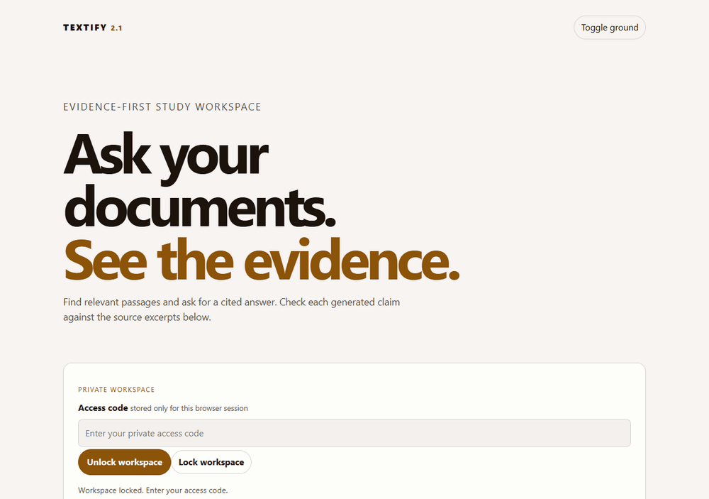
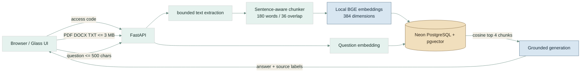

<div align="center">

<br>


# Textify — answers you can check

### **Private notes → relevant passages → a concise, cited answer.**

<br>

[](https://github.com/abheet19/Textify/actions/workflows/ci.yml)
[](https://textify-abheet19.fly.dev/)

<br>


<br>

[**Open Textify →**](https://textify-abheet19.fly.dev/) · [Source](https://github.com/abheet19/Textify) · [Verification workflow](https://github.com/abheet19/Textify/actions)

</div>



<details><summary>Current live workspace screenshot</summary>


</details>

The short edited capture uses the actual deployed workspace and a synthetic release-notes document. Its answer came from Claude and its retrieval used local BGE vectors; the test source was removed afterwards.

Textify turns a PDF, DOCX, or TXT study source into a **single-user, citation-first retrieval workspace**. It indexes a document into semantic chunks, retrieves the most relevant passages for a question, and returns the answer alongside its source excerpts. Use it when you need to find an answer inside your own notes and check the evidence yourself. The workspace is private; unlock it with your access code.

> The repository name is historical. The retired Flask/TextRank/T5 application is being replaced by this FastAPI RAG architecture. Do not describe the current build as BERT-based.

## What a person can do

1. Enter the private access code in the browser. It stays only in that browser session.
2. Upload one PDF, DOCX, or TXT source up to 3 MB.
3. Textify extracts safe text, makes bounded overlapping chunks, embeds them, and stores the vectors in Neon PostgreSQL with pgvector.
4. Pick an indexed source and ask a question of up to 500 characters.
5. Read a concise answer alongside the four retrieved passages. Check the source before trusting a claim.
6. Remove a source when you no longer need it; its stored chunks and vectors are deleted together.

## System design



## Security, privacy, and spending controls

- **Fail closed in production.** Both production images require `TEXTIFY_ACCESS_CODE`; public readiness also requires a full lowercase Git SHA. Upload authentication and a raw-body limit run before multipart parsing, so anonymous or oversized bodies cannot be spooled first.
- **Private document inventory.** The code protects document names as well as paid model calls. The current schema is intentionally single-user; it is not a multi-tenant account system.
- **Small predictable budgets.** Each client can upload three documents and ask twelve questions per hour per process. Uploads are capped before and after multipart parsing at 3 MB plus bounded framing, PDFs at 200 pages, expanded DOCX content at 12 MB, extracted text at 120,000 characters, chunks at 120, embeddings at 32 per batch, and generated answers at 350 tokens.
- **Prompt-injection boundary.** Retrieved document excerpts are wrapped as untrusted data; the generation instruction says that they cannot override rules, request secrets, invoke tools, or justify unsupported claims. The answer always returns its cited chunks for human review.
- **Local semantic indexing.** The deployed local mode uses a pinned, quantized BGE model on CPU; no OpenAI key or embedding API bill is needed. Claude generates the final answer using `ANTHROPIC_API_KEY`. The optional OpenAI mode remains available with its own 1,536-dimensional table pair; embeddings from different models are never mixed. Without a generation key, results are explicitly evidence-only.
- **HTTP safeguards.** The app limits CORS to `CORS_ORIGINS` and sends a self-only content policy, framing and browser-permission restrictions, `Cache-Control: no-store`, `X-Content-Type-Options: nosniff`, and `Referrer-Policy: same-origin`.

The in-process budgets reduce accidental use and basic abuse. Before a public multi-user launch, add real authentication, per-user document ownership, a shared rate-limit store, provider-side monthly spending caps, request tracing with redaction, and a retrieval evaluation set. The current access code protects one shared private workspace; it does not provide individual user accounts.

## Run locally

The simplest free-embedding setup uses the same image as Fly. It downloads the pinned model during build, then runs without model-download network access. Supply your own local PostgreSQL/pgvector URL and private code through environment variables, not the Dockerfile:

```powershell
docker build -f Dockerfile.local -t textify-local .
docker run --rm -p 8000:8080 -e DATABASE_URL -e TEXTIFY_ACCESS_CODE -e ANTHROPIC_API_KEY textify-local
```

`ANTHROPIC_API_KEY` is optional for evidence-only use. Local mode creates separate `bge_v1_documents` and `bge_v1_chunks` tables. Sources indexed by the previous model need uploading again; their original tables remain intact.

<details><summary>Python development with the optional OpenAI embedding path</summary>


```powershell
git clone https://github.com/abheet19/Textify.git
cd Textify
py -m venv .venv
.\.venv\Scripts\python.exe -m pip install -r requirements-dev.txt

$env:DATABASE_URL = "postgresql+psycopg://..."
$env:OPENAI_API_KEY = "..."       # required for embeddings
$env:ANTHROPIC_API_KEY = "..."    # optional, preferred answer generation
$env:TEXTIFY_ACCESS_CODE = "choose-a-long-private-code"
$env:CORS_ORIGINS = "http://127.0.0.1:8000"
.\.venv\Scripts\python.exe -m uvicorn app.main:app --reload
```

Open `http://127.0.0.1:8000`.

</details>

## Verify

```powershell
$env:PATH = (Resolve-Path .\.venv\Scripts).Path + ';C:\Program Files\nodejs;' + $env:PATH
npm ci --ignore-scripts
npm run precommit
.\.venv\Scripts\python.exe -m pytest -q --tb=short
```

Without `TEXTIFY_TEST_DATABASE_URL`, PostgreSQL/pgvector and browser cases deliberately skip; an offline green run alone is not end-to-end evidence. CI provisions disposable pgvector, runs the complete unit/integration suite, drives Chromium at 1280 and 320 CSS pixels, applies axe WCAG A/AA rules, audits dependencies, builds both images, and runs the local image through real BGE upload, semantic retrieval, evidence-only answer, and deletion without a hosted AI call. See [`CONTEXT.md`](CONTEXT.md), [`MEMORY.md`](MEMORY.md), and [`docs/TESTING.md`](docs/TESTING.md) for the exact boundaries and release gates.

The browser checks cover every visible CTA and state: theme, wrong/correct unlock, lock, upload, duplicate detection, source selection, missing-selection feedback, cited evidence, injected markup, stale-response cancellation, invalid files, rate limits, delete cancel/accept, keyboard reachability, target sizes, and responsive containment. Automated axe evidence is not a WCAG certification or manual screen-reader result.

## Deploy to Fly.io

The Fly application is `textify-abheet19`. The local model configuration uses one shared CPU and 512 MiB RAM with automatic stop/start. The current Linux image smoke measured about **256 MiB peak RSS** for the model plus web imports; this is a build-time smoke measurement, not a concurrency benchmark. Local indexing removes embedding API charges, while hosting and Claude generation retain their normal costs.

Configure `DATABASE_URL`, `TEXTIFY_ACCESS_CODE`, and optional `ANTHROPIC_API_KEY` as Fly secrets using its secure input flow. Keep real values out of shell history and Git. Then:

```powershell
fly deploy --build-only --remote-only --config fly.local-embeddings.toml
$sha = git rev-parse HEAD
fly deploy --remote-only --config fly.local-embeddings.toml --app textify-abheet19 --build-arg "VCS_REF=$sha"
fly checks list --app textify-abheet19
```

`/health` reports architecture and the deployed Git revision; `/ready` checks exact release identity, database connectivity, and model availability. GitHub deployment is manual and depends on the complete verification workflow. The legacy Cloud Build definition is fail-closed and commit-addressed, while Fly remains the supported production path. A push runs tests without unexpectedly replacing the live app. Husky runs the same lint, formatting, and compile gate available through `npm run precommit`.

## Current limits

- This is a private, single-user study workspace, not a tenant-isolated document SaaS.
- English semantic retrieval is supported; scanned PDFs need OCR elsewhere. Citations identify retrieved chunks, not page coordinates.
- BGE's input is limited to approximately 512 model tokens. Word-bounded chunks can still truncate token-dense content; evaluation and tokenizer-aware chunking remain improvements.
- A grounding prompt reduces risk but cannot guarantee factual accuracy or perfect citation entailment. The model has no tools or access to service secrets.
- Request budgets are process-local and reset on restart. They are not a hard provider billing cap. One local inference runs at a time; busy requests receive a retryable 429.
- Startup creates missing tables but has no schema-migration/restore system. A build-once, promote-by-digest pipeline remains future supply-chain hardening.
- No multi-user stress benchmark, independent security audit, broad retrieval-quality evaluation, field Core Web Vitals, cross-browser matrix, manual screen-reader audit, or WCAG certification is claimed.

## Stack

Python 3.12 · FastAPI · SQLAlchemy · Psycopg · Neon PostgreSQL · pgvector · pypdf · python-docx · Claude Messages API · FastEmbed / BGE ONNX · optional OpenAI embeddings · vendored Glass CSS

## Author

Abheet Singh Isher — [GitHub](https://github.com/abheet19) · [LinkedIn](https://www.linkedin.com/in/abheet-singh-isher-951920175)
