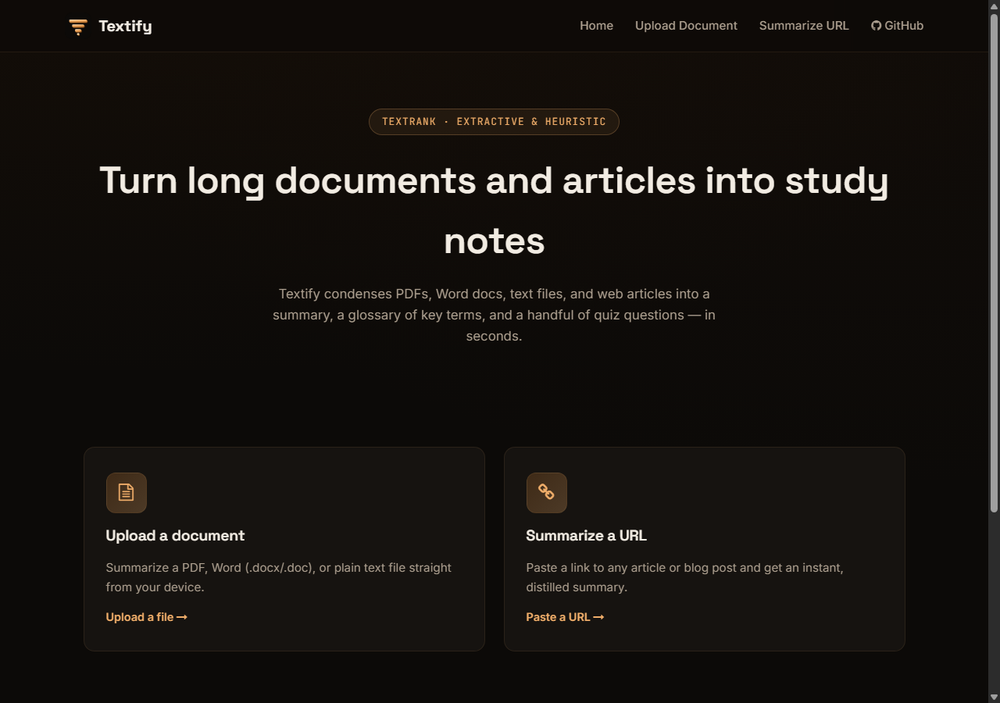

<div align="center">

<br>


# T E X T I F Y

### **Long text in. Study notes out.**

A PDF, a Word doc, a wall of plain text, or just a link — Textify turns it into a summary,
a glossary of key terms, and a handful of quiz questions, in a couple of seconds, on a
free-tier VM.

<br>


<br>

<sub>A personal project by <b><a href="https://github.com/abheet19">Abheet</a></b> — small, single-purpose, and one of a family of projects sharing a dark-glass look with its own accent per app.</sub>

<br>

</div>

> [!NOTE]
> **Live at [textify-abheet19.fly.dev](https://textify-abheet19.fly.dev)**, on Fly.io's
> free tier (256MB shared-CPU VM, scales to zero when idle — the first request after a
> while may take a few seconds to wake the machine).

---

## The problem

Reading a 3,000-word article, or a PDF report someone forwarded you, to decide whether it's
worth reading — let alone studying — costs more time than the content itself. "Summarize
this" alone isn't much of a pitch anymore: ChatGPT and every other LLM chat does that
trivially, for free, and often better than a purpose-built tool can. What none of them hand
back by default is something you can actually *study from* — a glossary of the terms that
matter, and questions to check whether you actually absorbed it.

Textify does the summarize-condense-and-quiz workflow in one pass, over whatever you hand
it — an uploaded file or a pasted URL — without an LLM, an API key, or a GPU.

## What it does

- **Three input paths**: upload a PDF, DOCX, DOC, or TXT file, or paste an article URL
- **Extractive summary**: TextRank (via `sumy`) ranks the document's own sentences by how
  central they are to the whole, and returns the top few — no rewriting, so every sentence
  in the summary is one you could find, verbatim, in the source
- **Glossary**: recurring proper-noun phrases and frequent, meaningful words, each paired
  with a source sentence for context — built from capitalization and frequency heuristics,
  not a trained NER model
- **Quiz questions**: two techniques, both genuinely derived from the source text rather
  than templated filler — "X is/are Y" sentences become "What is X?" question-answer pairs,
  and sentences containing a glossary term become fill-in-the-blank questions with that term
  blanked out
- **Reading stats**: word count, sentence count, and an estimated reading time
- **Homepage-aware scraping**: detects when a URL is a news homepage rather than a single
  article and pulls headlines, article blocks, and story paragraphs instead of the whole
  page's boilerplate
- **Export**: download the summary as a formatted DOCX or PDF
- **Copy to clipboard**: one click, no download required, on both result pages

## Honesty note

This is **not** an LLM. There's no abstractive rewriting, no model weights, no GPU — the
summary is extractive (picked sentences, not generated ones) and the glossary/quiz are rule-
based heuristics over word frequency, capitalization, and simple sentence-shape matching.
That's a deliberate trade: it means Textify runs comfortably in 256MB of RAM with no
inference cost, at the price of being less flexible than an LLM about phrasing, tone, or
handling text that doesn't fit its heuristics cleanly (very short input, text with unusual
capitalization, or content with few clean "X is Y" sentences will produce a thinner glossary
and fewer quiz questions — it says so in the UI rather than faking a result).

## Tech stack

| Layer | What | Why |
|---|---|---|
| Backend | Flask 3, Python 3.10+ | small blueprint-based app, one route file |
| Summarization | `sumy` (TextRank) | extractive, pure Python graph-ranking over sentences — no model weights, no GPU |
| Sentence tokenization | NLTK (`punkt_tab`), baked into the Docker image at build time | required by sumy, no runtime download |
| Glossary & quiz | Standard library `re` / `collections.Counter` | frequency + capitalization heuristics and definition-sentence pattern matching |
| Web scraping | BeautifulSoup4, Requests | article and homepage text extraction |
| Document parsing | PyPDF2, python-docx | reading uploaded PDF / DOCX content |
| Report generation | fpdf2, python-docx | writing the downloadable PDF / DOCX summary |
| Visualization | WordCloud, Matplotlib | word-cloud generation from the cleaned text |
| Frontend | Jinja2 templates, vanilla JS, hand-written CSS | tabbed Summary/Glossary/Quiz view, dropzone, clipboard — no framework |
| Ops | Gunicorn, Docker, Flask-CORS, Fly.io | production server, containerization, cross-origin, hosting |

## Install & run

```bash
git clone https://github.com/abheet19/Textify.git
cd Textify

python -m venv .venv
.venv\Scripts\activate        # Windows
# source .venv/bin/activate   # macOS/Linux

pip install -r requirements.txt
python -c "import nltk; nltk.download('punkt_tab')"   # one-time, for sumy's tokenizer
python run.py
```

Then open `http://localhost:5000`.

<details>
<summary><b>Docker</b></summary>

<br>

```bash
docker build -t textify .
docker run -p 5000:5000 textify
```

</details>

<details>
<summary><b>Environment variables</b></summary>

<br>

| Variable | Default | Purpose |
|---|---|---|
| `PORT` | `5000` | port to bind |
| `SECRET_KEY` | dev default | Flask session secret — set a real one in production |
| `FLASK_ENV` | unset | set to `development` for debug mode |
| `NLTK_DATA` | unset (Docker sets it to `/usr/local/share/nltk_data`) | where sumy's NLTK tokenizer data lives |

</details>

## Design

Textify is one of a small family of personal projects sharing a dark-glass visual language —
translucent cards, Space Grotesk headings, Inter body text — but each project gets its own
accent so they don't read as one reskinned template. Textify's is **copper/amber**
(`#F0AE6A → #E0954D → #B9702A` on a `#0C0A08` ground), distinct from the teal/indigo weave
used elsewhere in the family and the gold/ochre funnel used in the analytics project.

The mark itself (`brand/mark.svg`) is built from the same three-plane technique as its
siblings — a cast, a flank, and a lit face — but its own geometry: four lines of decreasing
width, centered and converging on a single lit point, rather than a funnel or an interlace.
It's meant to read as *text, condensing* — the whole point of the app.

The result page uses a segmented tab control (Summary / Glossary / Quiz) over a shared
card shell, so the three outputs read as one cohesive study-notes document instead of a
wall of text with extra sections bolted underneath.

## Screenshots

Captured live from [the deployed app](https://textify-abheet19.fly.dev/).



## Project structure

```text
Textify/
├─ app/
│  ├─ __init__.py       Flask application factory
│  ├─ api.py            routes: upload, URL, download, themed error page
│  ├─ service.py         extraction, cleaning, TextRank summary, glossary, quiz, PDF/DOCX export
│  ├─ templates/         Jinja2 templates (dropzone, tabbed results, error page)
│  └─ static/            CSS, fonts, brand assets
├─ brand/mark.svg        the brand mark, documented inline
├─ config.py             environment-driven configuration
├─ run.py                entry point
├─ Dockerfile
└─ requirements.txt
```

## What it doesn't do yet

- **No summary-length control.** The summarizer picks its own target sentence count
  adaptively based on how much content it's given, rather than exposing a short/medium/long
  knob.
- **Heuristic glossary and quiz, not NLP-model-backed.** They're honest about what they are
  (see Honesty note above) — good enough to be useful, not a substitute for a real NER/QA
  model if one were ever added back in.
- **English only.** The proper-noun and definition-sentence heuristics, and the NLTK
  tokenizer data baked into the image, are English-specific.

---

<div align="center">

<br>

Built by **[Abheet Singh Isher](https://github.com/abheet19)**

<br>

</div>
