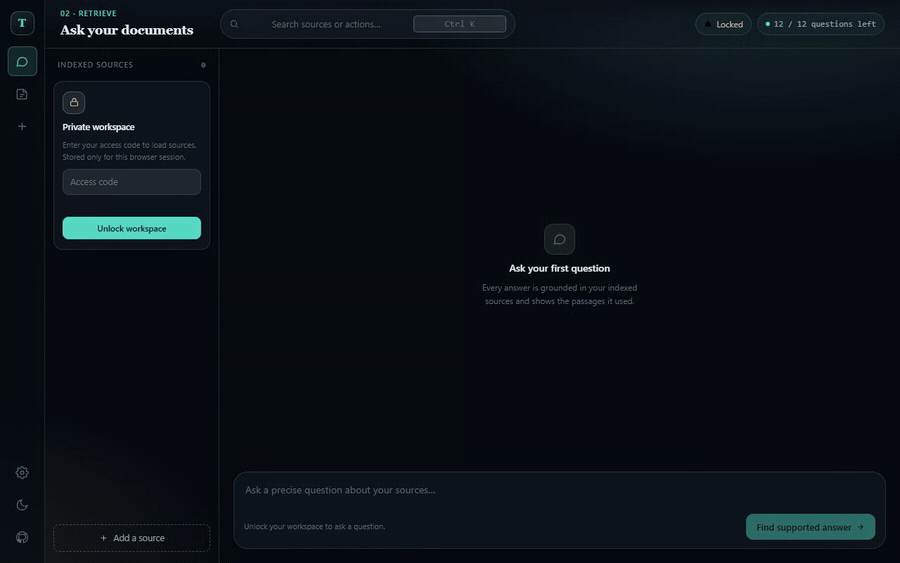
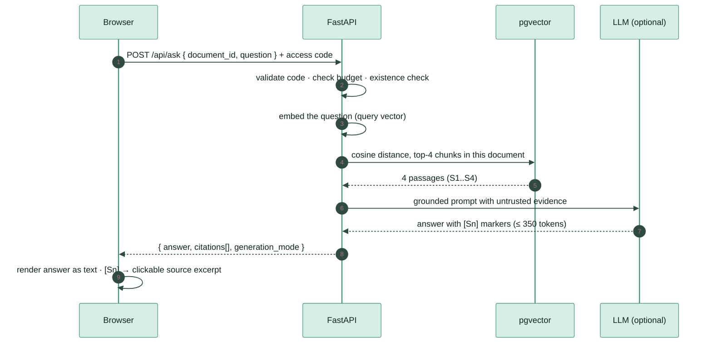

<div align="center">

<br>


# Textify — answers you can check

### **Point it at your own PDF. Ask a question. Get a concise answer that shows the exact passages it stands on.**

<br>

[](https://github.com/abheet19/Textify/actions/workflows/ci.yml)
[](https://textify-abheet19.fly.dev/)
[](https://textify-abheet19.fly.dev/)

<br>


<br>

[**Open Textify →**](https://textify-abheet19.fly.dev/) · [Source](https://github.com/abheet19/Textify) · [Verification workflow](https://github.com/abheet19/Textify/actions) · [`CONTEXT.md`](CONTEXT.md)

</div>

---

## The problem

A general chatbot will happily answer a question about *your* material and quietly make something up. When the source is your own study notes, a contract, or a research PDF, a fluent answer you can't trace is worse than no answer. **Textify never answers without showing its evidence.** Every reply is retrieved from *your* indexed document and rendered next to the exact passages it used, so you can check the claim before you trust it.

## Demo



<div align="center">

**▶ [Watch the smooth 60fps capture (MP4)](docs/media/textify-reel.mp4)** · captured live at [textify-abheet19.fly.dev](https://textify-abheet19.fly.dev/)

</div>

> **About this capture.** Every pixel is the real, deployed **redesign-glass** frontend — the glass shell, the ⌘K command palette, the lock/unlock state machine, and the *chunk → semantic → cited* answer rendering are all the shipped app running live. Because the live instance is a **private single-user workspace behind a secret access code** (a wrong code returns `401`, by design), the two private API responses in this walkthrough are seeded with a small **representative demo workspace** so the answer-with-evidence beat renders. The evidence sentences shown are drawn verbatim from a real public-domain document (`tools/demo-assets/antikythera-mechanism.txt`). Nothing about the pipeline, UI, or citation rendering is faked — only the private document payloads are seeded. To capture a *real* unlocked workspace, run the script with your own `TEXTIFY_ACCESS_CODE` and `TEXTIFY_LIVE_DATA=1`.

## What you can do

1. **Unlock** the private workspace with your access code — it lives only in that browser session (`sessionStorage`), never `localStorage`, never the server logs.
2. **Index** a PDF, DOCX, or TXT source (up to 3 MB). Textify extracts safe text, cuts sentence-aware overlapping chunks, embeds them, and stores the vectors in PostgreSQL + pgvector.
3. **Retrieve** — pick a source, ask a question (≤ 500 chars), and get the top-4 most semantically relevant passages.
4. **Answer** — read a concise, grounded reply with inline `[S1] [S2]` citations you can click to open the source excerpt. No generation key? You get the retrieved evidence explicitly, labelled `evidence-only`.
5. **Delete** a source and its chunks/embeddings cascade away together.

Drive the whole thing from the keyboard with the **⌘K / Ctrl-K command palette**: ask, jump to a source, add a source, lock/unlock, toggle theme.

## Architecture

```mermaid
%%{init: {'theme':'base','themeVariables':{'fontFamily':'ui-sans-serif, system-ui','primaryColor':'#e9f6f1','primaryTextColor':'#12241f','lineColor':'#4f8a7b','clusterBkg':'#0d1412','clusterBorder':'#20302b'}}}%%
flowchart LR
    subgraph Client
      U["Glass UI<br/>vanilla JS state machine"]
    end
    subgraph Edge["FastAPI (ASGI)"]
      G0["Pre-body upload gate<br/>auth + raw-size cap"]
      RT["Routes + per-client budgets"]
    end
    subgraph Ingest["Index pipeline"]
      X["Bounded extraction<br/>PDF / DOCX / TXT"]
      CK["Sentence-aware chunker<br/>180 words · 36 overlap"]
      EM["Embeddings<br/>OpenAI 1536-d · or local BGE 384-d"]
    end
    subgraph Query["Retrieve + answer"]
      QE["Question embedding"]
      TK["pgvector cosine · top-4"]
      GEN["Grounded generation<br/>or evidence-only"]
    end
    DB[("PostgreSQL<br/>+ pgvector")]

    U -->|"access code"| G0 --> RT
    U -->|"PDF/DOCX/TXT ≤ 3 MB"| G0
    RT --> X --> CK --> EM --> DB
    U -->|"question ≤ 500 chars"| RT --> QE --> TK
    DB --> TK --> GEN -->|"answer + [S1..S4] citations"| U

    classDef ui fill:#dbe7f1,stroke:#5c7990,color:#15293a;
    classDef gate fill:#f6e0c6,stroke:#b07f45,color:#3a2a15;
    classDef model fill:#d6efe6,stroke:#3f8f77,color:#123a30;
    classDef store fill:#efe0f5,stroke:#8b5ca6,color:#2e1c38;
    class U ui;
    class G0,RT gate;
    class EM,GEN,QE model;
    class DB store;
```



And the ask → cited-answer round trip, end to end:



## System design — the interesting engineering

- **Access *before* the body is read.** A hand-written ASGI middleware validates the access code and caps the raw request size *before* multipart parsing spools an `UploadFile`. An anonymous or oversized upload is rejected without ever being buffered to disk — a class of resource-exhaustion the naive "parse then check" order gets wrong.
- **The database connection is never held during inference.** Embedding a batch (hosted or on-CPU) can take seconds. Textify closes the pooled DB session before any provider/model call and opens a fresh short transaction for the write, so slow inference can't starve the connection pool.
- **Semantic retrieval, not keyword match.** Chunks are embedded and ranked by `pgvector` cosine distance, scoped to the selected document, returning the top 4 passages — a bounded top-*k* over one document's vectors. Query vectors and passage vectors are embedded with the matching mode.
- **Embedding-space isolation.** Two embedding backends are supported — OpenAI `text-embedding-3-small` (1536-d) and a pinned quantized `BAAI/bge-small-en-v1.5` ONNX model (384-d, zero API cost). They live in **separate table pairs** because vectors from different models are geometrically incompatible; the code makes mixing them impossible, not merely discouraged.
- **Idempotent, race-safe ingest.** A document's identity is a normalized full SHA-256 fingerprint with a `UNIQUE` constraint; a concurrent duplicate that slips past the pre-check is caught by the constraint and recovered to the existing row, so re-uploading the same file is a no-op, not a duplicate.
- **A prompt-injection boundary.** Retrieved excerpts are wrapped as explicitly untrusted data; the generation instruction states they cannot override rules, reveal secrets, or justify unsupported claims. The answer always returns its cited chunks for human review, and the UI renders every piece of document/answer text with `textContent` — never `innerHTML` — so a `` inside a source is inert text.
- **A front-end that refuses to leak stale private state.** Every workspace transition (unlock, lock, source switch) bumps a version token and aborts in-flight `fetch`es via `AbortController`. A private answer that resolves *after* you lock the workspace is dropped instead of painting onto the screen.

## Quick start

**Run it like Fly does — free local embeddings, no API key:**

```powershell
docker build -f Dockerfile.local -t textify-local .
docker run --rm -p 8000:8080 `
  -e DATABASE_URL `
  -e TEXTIFY_ACCESS_CODE `
  -e ANTHROPIC_API_KEY `      # optional: without it, answers are evidence-only
  textify-local
# open http://localhost:8000
```

Local mode downloads the pinned BGE model at build time and creates its own `bge_v1_documents` / `bge_v1_chunks` tables.

<details><summary><b>Python dev loop (with the optional OpenAI embedding path)</b></summary>

```powershell
git clone https://github.com/abheet19/Textify.git
cd Textify
py -m venv .venv
.\.venv\Scripts\python.exe -m pip install -r requirements-dev.txt

$env:DATABASE_URL       = "postgresql+psycopg://..."   # Postgres 17 + pgvector
$env:OPENAI_API_KEY     = "..."                        # required for embeddings in this path
$env:ANTHROPIC_API_KEY  = "..."                        # optional, preferred answer generation
$env:TEXTIFY_ACCESS_CODE= "choose-a-long-private-code"
$env:CORS_ORIGINS       = "http://127.0.0.1:8000"
.\.venv\Scripts\python.exe -m uvicorn app.main:app --reload
```

Open `http://127.0.0.1:8000`.

</details>

<details><summary><b>Re-capture the demo reel</b></summary>

```powershell
npm ci --ignore-scripts
npx playwright install chromium
node tools/capture-reel60.mjs           # → docs/media/textify-reel.mp4 (60fps) + docs/media/textify-demo.gif
```

The script targets the live site by default (`TEXTIFY_URL` overrides), warms the scale-to-zero Fly machine, records with Playwright, and renders a motion-interpolated 60fps H.264 with `ffmpeg` (`FFMPEG` env overrides the binary path). Set `TEXTIFY_ACCESS_CODE` + `TEXTIFY_LIVE_DATA=1` to record a real unlocked workspace instead of the seeded demo.

</details>

## Verify

```powershell
$env:PATH = (Resolve-Path .\.venv\Scripts).Path + ';C:\Program Files\nodejs;' + $env:PATH
npm ci --ignore-scripts
npm run precommit          # Ruff + ESLint + Prettier + compileall
.\.venv\Scripts\python.exe -m pytest -q --tb=short
```

Without `TEXTIFY_TEST_DATABASE_URL`, the PostgreSQL/pgvector and browser cases deliberately skip — an offline green run is not end-to-end evidence. CI provisions disposable pgvector, runs the full unit/integration suite, drives Chromium at 1280 and 320 CSS pixels, applies axe WCAG 2 A/AA rules, audits dependencies, builds both images, and runs the local image through a real BGE **upload → semantic retrieval → evidence-only answer → delete** flow with no hosted AI call. Automated axe evidence is not a WCAG certification or a manual screen-reader result.

## Live deployment

The Fly app is **`textify-abheet19`** (one shared CPU, 512 MiB, auto stop/start). `/version` identifies the deployed Git SHA and current FastAPI/RAG stack; `/health` reports the same release plus storage, retrieval mode, and the active embedding provider; `/ready` additionally checks release identity, DB connectivity, and model availability. The instance currently live reports the pinned local **BGE 384-d embedding path**, so document embeddings do not leave the service; OpenAI's 1536-d path remains an optional, separately stored alternative. `POST /mcp` is a real stateless Streamable HTTP MCP server over the public synthetic demo. It exposes only `list_demo_sources` and `ask_demo_question`; private upload, listing and deletion remain behind the access-code REST boundary. Connect Claude Code with `claude mcp add --transport http textify https://textify-abheet19.fly.dev/mcp`.

```powershell
fly deploy --build-only --remote-only --config fly.local-embeddings.toml
$sha = git rev-parse HEAD
fly deploy --remote-only --config fly.local-embeddings.toml --app textify-abheet19 --build-arg "VCS_REF=$sha"
fly checks list --app textify-abheet19
```

Configure `DATABASE_URL`, `TEXTIFY_ACCESS_CODE`, and optional `ANTHROPIC_API_KEY` as Fly secrets through its secure input flow — keep real values out of shell history and Git.

## Honest limits

- Private **single-user** study workspace — one shared access code, not accounts, tenancy, ownership, or recovery.
- English semantic retrieval; scanned PDFs need OCR elsewhere. Citations identify retrieved chunks, not page coordinates.
- Word-bounded chunks can still exceed a model's tokenizer window and truncate token-dense text; tokenizer-aware chunking is future work.
- A grounding prompt reduces risk but does not guarantee factual accuracy or perfect citation entailment.
- Rate-limit budgets are process-local and reset on restart — not a provider billing cap. One local inference runs at a time; busy callers get a retryable `429`.
- Startup uses `create_all`; no schema-migration/restore drill yet, and no build-once/promote-by-digest supply chain.
- No multi-user load benchmark, independent security audit, broad retrieval-quality eval, field Core Web Vitals, cross-browser matrix, or WCAG certification is claimed.

> The repository name is historical. The retired Flask / TextRank / T5 app has been replaced by this FastAPI RAG architecture — do not describe the current build as BERT-based.

## Stack

Python 3.12 · FastAPI · SQLAlchemy · Psycopg · PostgreSQL · pgvector · pypdf · python-docx · Claude Messages API (optional) · FastEmbed / BGE ONNX · optional OpenAI embeddings · vanilla-JS glass UI · Playwright + ffmpeg capture · Fly.io

## Author

**Abheet Singh Isher** — [GitHub](https://github.com/abheet19) · [LinkedIn](https://www.linkedin.com/in/abheet-singh-isher-951920175)
