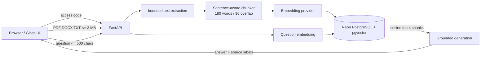

# Textify — citation-first study RAG


Textify turns a PDF, DOCX, or TXT study source into a **single-user, citation-first retrieval workspace**. It indexes a document into semantic chunks, retrieves the most relevant passages for a question, and returns the answer alongside its source excerpts. The screenshot above is from the current FastAPI build; it shows the private-workspace gate, bounded upload, and bounded question flow.

> The repository name is historical. The retired Flask/TextRank/T5 application is being replaced by this FastAPI RAG architecture. Do not describe the current build as BERT-based.

## What a person can do

1. Enter the private access code in the browser. It stays only in that browser session.
2. Upload one PDF, DOCX, or TXT source up to 3 MB.
3. Textify extracts safe text, makes bounded overlapping chunks, embeds them, and stores the vectors in Neon PostgreSQL with pgvector.
4. Pick an indexed source and ask a question of up to 500 characters.
5. Textify retrieves the closest four chunks, generates a bounded answer, and renders the exact evidence used for the answer.

## System design



## Security, privacy, and spending controls

- **Fail closed in production.** If a Fly deployment does not have `TEXTIFY_ACCESS_CODE`, upload, document-list, and ask endpoints return 503. A valid code is required when one is configured.
- **Private document inventory.** The code protects document names as well as paid model calls. The current schema is intentionally single-user; it is not a multi-tenant account system.
- **Small predictable budgets.** Each client can upload three documents and ask twelve questions per hour per process. Uploads are capped at 3 MB, PDFs at 200 pages, expanded DOCX content at 12 MB, extracted text at 120,000 characters, chunks at 120, embeddings at 32 per batch, and generated answers at 350 tokens.
- **Prompt-injection boundary.** Retrieved document excerpts are wrapped as untrusted data; the generation instruction says that they cannot override rules, request secrets, invoke tools, or justify unsupported claims. The answer always returns its cited chunks for human review.
- **Provider separation.** `OPENAI_API_KEY` is required for `text-embedding-3-small` indexing. `ANTHROPIC_API_KEY` is preferred for final answer generation; OpenAI generation is an optional fallback. The app never stores a document when semantic indexing is unavailable.
- **HTTP safeguards.** The app limits CORS to `CORS_ORIGINS`, adds `Cache-Control: no-store`, `X-Content-Type-Options: nosniff`, and `Referrer-Policy: same-origin`.

The in-process budgets reduce accidental use and basic abuse. Before a public multi-user launch, add real authentication, per-user document ownership, a shared rate-limit store, provider-side monthly spending caps, request tracing with redaction, deletion controls, and a retrieval evaluation set.

## Run locally

```powershell
git clone https://github.com/abheet19/Text-Summarizer-System_BERT.git
cd Text-Summarizer-System_BERT
py -m venv .venv
.\.venv\Scripts\python.exe -m pip install -r requirements-dev.txt

$env:DATABASE_URL = "postgresql+psycopg://..."
$env:OPENAI_API_KEY = "..."       # required for embeddings
$env:ANTHROPIC_API_KEY = "..."    # optional, preferred answer generation
$env:TEXTIFY_ACCESS_CODE = "choose-a-long-private-code"
$env:CORS_ORIGINS = "http://127.0.0.1:8000"
.\.venv\Scripts\python.exe -m uvicorn app.main:app --reload
```

Open `http://127.0.0.1:8000`.

## Verify

```powershell
.\.venv\Scripts\python.exe -m pytest -q
```

The focused suite checks chunk overlap, fingerprints, evidence-only behavior, the private access-code guard, and request-shape limits without requiring a live database.

## Deploy to Fly.io

The Fly application is `textify-abheet19`. Before deploying the current build, configure a long access code, an embeddings key, allowed origin, and provider spending caps in their dashboards.

```powershell
fly secrets set TEXTIFY_ACCESS_CODE="choose-a-long-random-code" --app textify-abheet19
fly secrets set OPENAI_API_KEY="..." --app textify-abheet19
fly secrets set ANTHROPIC_API_KEY="..." --app textify-abheet19
fly secrets set CORS_ORIGINS="https://textify-abheet19.fly.dev" --app textify-abheet19
fly deploy --app textify-abheet19
```

Never commit `.env.local` or API keys. A deployment is ready only after a provider-backed upload and a cited answer are exercised through the browser.

## Stack

Python 3.12 · FastAPI · SQLAlchemy · Psycopg · Neon PostgreSQL · pgvector · pypdf · python-docx · Claude Messages API · OpenAI embeddings · Glass CSS

## Author

Abheet Singh Isher — [GitHub](https://github.com/abheet19) · [LinkedIn](https://www.linkedin.com/in/abheet-singh-isher-951920175)
